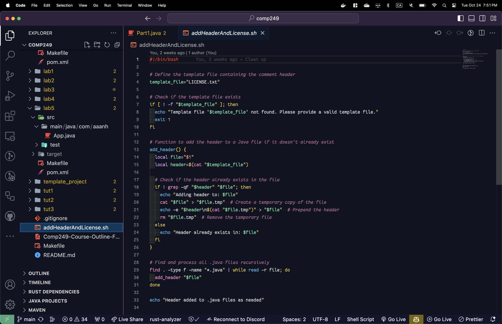
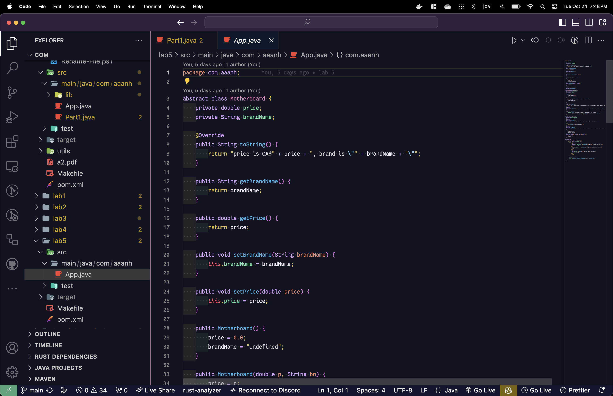
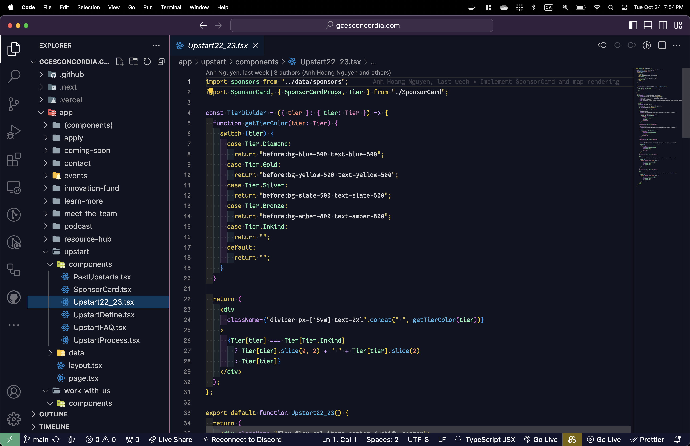

# Artoria Theme

I meant to build this as kind of a joke to explore VS Code extension development, but I am now too deep into the rabbit hole and I am enjoying the theme a little too much. So, expect more future updates 👌

## Downloads and Install

https://themes.aaanh.app

## Screenshots

- Bash shell script sample

- Java sample

- React TypeScript sample

## Original Inspiration

## Contributions

[Fork the repo](https://github.com/aaanh/vsce-artoria-theme/fork)!

All patches and suggestions are welcomed through [pull requests](https://github.com/aaanh/vsce-artoria-theme/pulls) and [issues](https://github.com/aaanh/vsce-artoria-theme/issues).

## Acknowledgement

The exported themes are based on Visual Studio Code theme as the single source of truth and the following tools are used to generate the corresponding platform theme:

- iTerm2: https://github.com/campvanilla/ditto
- Windows Terminal: https://marketplace.visualstudio.com/items?itemName=blake-mealey.generate-wt-scheme
- (neo)vim: https://github.com/viniciusmuller/djanho
