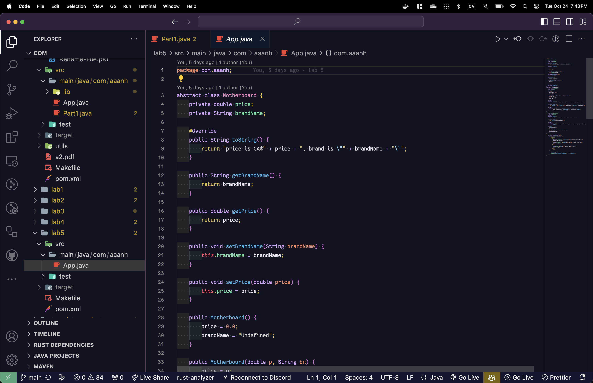
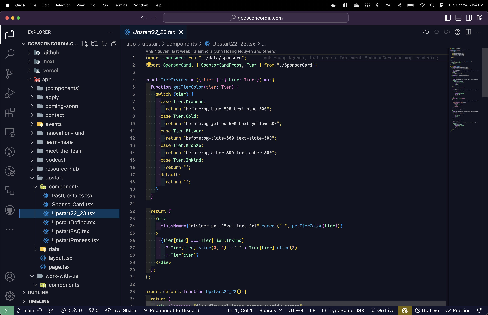

# Artoria Theme

I meant to build this as kind of a joke to explore VS Code extension development, but I am now too deep into the rabbit hole and I am enjoying the theme a little too much. So, expect more future updates 👌

## Screenshots

- Bash shell script sample

- Java sample

- React TypeScript sample

## Original Inspiration

## Contributions

[Fork the repo](https://github.com/aaanh/vsce-artoria-theme/fork)!

All patches and suggestions are welcomed through [pull requests](https://github.com/aaanh/vsce-artoria-theme/pulls) and [issues](https://github.com/aaanh/vsce-artoria-theme/issues).
